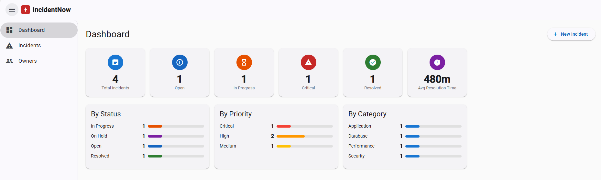

# IncidentNow

IT incident management platform with a REST API backend and an Angular frontend.



## Repository Structure

```
├── api/                  # OpenAPI 3.0 specification (openapi.yaml)
├── backend/              # Spring Boot REST API (Java 21, Maven)
└── frontend/             # Angular 21 SPA with Angular Material
```

### API Definition (`api/`)

OpenAPI 3.0 spec covering all endpoints: incidents, owners, comments, timeline, and statistics.

### Backend (`backend/`)

- **Framework:** Spring Boot 3.5.7, Java 21
- **Database:** H2 in-memory (auto-populated with sample data)
- **Context path:** `/api/v1`
- **Port:** 8080
- **Sample data language:** configurable via `app.data.language` (`en` or `es`, default `es`)

### Frontend (`frontend/`)

- **Framework:** Angular 21 with Angular Material
- **Features:** Dashboard with stats, incident CRUD, owner management, comments, timeline
- **API endpoint:** configurable in `src/environments/environment.ts` (default `http://localhost:8080/api/v1`)

## Prerequisites

- Java 21+
- Maven 3.9+
- Node.js 22+ and npm 11+
- Angular CLI (`npm install -g @angular/cli`)

## Running Locally

### 1. Start the Backend

```bash
cd backend
mvn spring-boot:run
```

The API will be available at `http://localhost:8080/api/v1`. Swagger UI is at `http://localhost:8080/api/v1/swagger-ui.html`.

### 2. Start the Frontend

```bash
cd frontend
npm install
ng serve
```

The app will be available at `http://localhost:4200`.

### Configuration

| Setting | File | Default |
|---|---|---|
| API port | `backend/src/main/resources/application.yml` | `8080` |
| Sample data language | `backend/src/main/resources/application.yml` → `app.data.language` | `es` |
| Frontend API URL | `frontend/src/environments/environment.ts` → `apiBaseUrl` | `http://localhost:8080/api/v1` |
