# Incident Management API - Entity Relationship Diagram

```mermaid
erDiagram
    INCIDENT {
        uuid id PK
        string incidentNumber UK "INC-2026-0001"
        string title
        text description
        enum status "open|in_progress|on_hold|resolved|closed"
        enum priority "low|medium|high|critical"
        enum severity "low|medium|high|critical"
        enum category "network|hardware|software|security|..."
        array tags
        array affectedSystems
        int affectedUsers
        text rootCause
        text resolution
        text workaround
        datetime dueDate
        datetime createdAt
        datetime updatedAt
        datetime acknowledgedAt
        datetime resolvedAt
        datetime closedAt
        boolean slaBreached
        int timeToAcknowledge "minutes"
        int timeToResolve "minutes"
    }

    OWNER {
        uuid id PK
        string name
        string email UK
        string phone
        string avatarUrl
        string team
        enum role "engineer|senior_engineer|team_lead|manager|admin"
        string department
        string timezone "IANA format"
        string slackHandle
        string githubUsername
        boolean active
        boolean onCall
        datetime createdAt
        datetime updatedAt
    }

    GITHUB_REPO {
        uuid id PK
        uuid incidentId FK
        string repoOwner
        string repoName
        string repoUrl
        string branch
        int issueNumber
        string issueUrl
        int pullRequestNumber
        string pullRequestUrl
        string commitSha
    }

    COMMENT {
        uuid id PK
        uuid incidentId FK
        uuid authorId FK
        text content
        boolean isInternal
        datetime createdAt
        datetime updatedAt
    }

    TIMELINE_EVENT {
        uuid id PK
        uuid incidentId FK
        uuid actorId FK
        enum eventType "created|status_changed|assigned|resolved|..."
        string description
        string previousValue
        string newValue
        datetime timestamp
    }

    INCIDENT_ASSIGNEE {
        uuid incidentId FK
        uuid ownerId FK
    }

    %% Relationships
    INCIDENT ||--o| OWNER : "owned by"
    INCIDENT ||--o{ INCIDENT_ASSIGNEE : "has"
    OWNER ||--o{ INCIDENT_ASSIGNEE : "assigned to"
    INCIDENT ||--o| GITHUB_REPO : "linked to"
    INCIDENT ||--o{ COMMENT : "has"
    OWNER ||--o{ COMMENT : "authored"
    INCIDENT ||--o{ TIMELINE_EVENT : "has"
    OWNER ||--o{ TIMELINE_EVENT : "performed by"
```

## Relationship Summary

| Relationship | Cardinality | Description |
|--------------|-------------|-------------|
| Incident → Owner (owner) | Many-to-One | Each incident has one primary owner |
| Incident → Owner (assignees) | Many-to-Many | Incidents can have multiple assignees |
| Incident → GitHubRepo | One-to-One (optional) | Each incident can optionally link to GitHub |
| Incident → Comment | One-to-Many | Incidents can have multiple comments |
| Incident → TimelineEvent | One-to-Many | Incidents have audit trail events |
| Owner → Comment | One-to-Many | Owners author comments |
| Owner → TimelineEvent | One-to-Many | Owners perform actions |

## Enumerations

## State Diagram - Incident Lifecycle

